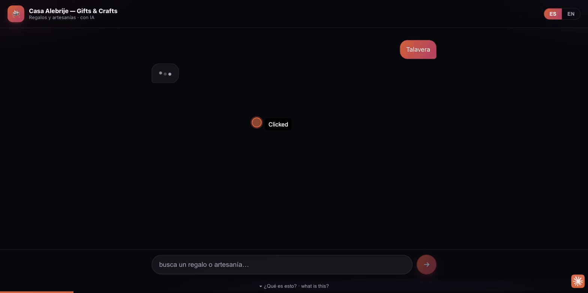

# Asistente de Tienda — WhatsApp Retail Support + Sales Agent (es-MX)

PRD 3 reference implementation. A grounded WhatsApp commerce agent that answers
product questions from a **real catalog**, checks inventory and shipping, looks
up order status, initiates returns within policy, and hands off a secure payment
link — **without hallucinating specs, stock, prices, or order data**.

The "wow" is *trustworthy grounding*: ask for something not in the catalog and it
says so; ask for something real and it gives specs, photos, shipping, and a pay
link; ask "where's my order?" and it does a live lookup. Hallucination is
prevented in **code**, not just in the prompt.

> Self-contained Rust crate. It stands in for the shared runtime referenced in
> the PRD: catalog/orders, the seven tools, the es-MX persona + guardrails, the
> Anthropic tool-use loop, and a CLI WhatsApp simulator for the demo.

---

## Demo



- 🔴 **Demo en vivo:** [asistente-de-tienda-production.up.railway.app](https://asistente-de-tienda-production.up.railway.app/)
- 📄 **Detalles:** [asistente-de-tienda.vercel.app](https://asistente-de-tienda.vercel.app/)
- ▶️ **Video:** [youtu.be/Idg40dF3FZE](https://youtu.be/Idg40dF3FZE)

---

## Quickstart

```bash
cp .env.example .env        # add your ANTHROPIC_API_KEY
cargo run --bin tienda -- --debug
```

`--debug` prints the live tool-call trace (the PRD's annotated flow). Then:

```
cliente ▸ tienen la mochila Vortex en negro?
   → search_products({"query":"mochila Vortex","color":"negro"})
   ⇐ {"total":1,"resultados":[{"sku":"VTX",...,"precio_mxn":1290}]}
🛍 Asistente de Tienda ▸ Sí 🎒 La Mochila Vortex en negro está disponible — $1,290 ...
```

No API key yet? The whole data + guardrail layer is still verifiable offline:

```bash
make verify        # python3 oracle over the seed data — 19 invariants, no network
make test          # cargo test — same invariants in Rust
```

---

## The demo (the wow)

```bash
make demo
```

1. **Out-of-catalog** → `search_products` returns `total:0` → agent says it's not
   available (proves no fabrication).
2. **Real product** → specs, price, photo URLs, `check_shipping` quote, and a
   `create_order_link` secure pay link.
3. **Post-sale** → `get_order_status("10482")` → live "en camino", guía TRACK-99213.

Try also: ask for the Vortex in **gris** (out of stock) — it refuses to sell and
offers the in-stock colors instead.

---

## Tools

| Tool | Returns | Guardrail (enforced in code) |
|------|---------|------------------------------|
| `search_products` | matching catalog rows | only real rows; `total:0` ⇒ "no existe" |
| `check_inventory` | stock for a SKU | variant- or product-level truth |
| `check_shipping` | cost + ETA | from config table; national fallback |
| `get_order_status` | order state + guía | unknown id ⇒ `encontrado:false` |
| `start_return` | RMA or rejection | **only** if delivered & within N days |
| `create_order_link` | secure pay link | **refuses** OOS / oversell; offers alternatives |
| `handoff_human` | ticket + summary | escalation path for edges |

Two layers protect grounding: the **prompt** (`src/prompt.rs`) states the rules,
and the **tool layer** (`src/tools/`) is the backstop — e.g. `create_order_link`
returns `error:"sin_stock"` with real alternatives instead of a pay link, so the
model physically cannot sell what isn't there. The LLM never sees or handles card
data; payment happens only through the returned link.

---

## White-label config surface

Swap `config/store.toml` + `data/*.json` → new store in minutes.

- `config/store.toml` — store identity, persona/tono, return policy + window,
  shipping table, payment link base, **per-flow toggles** (`[flujos]`), branding,
  model + max_tokens.
- `data/products.json` — catalog: variant-level SKUs, stock, prices, colors,
  sizes, photos, per-product return policy.
- `data/orders.json` — sample orders driving the support flow.

Disabled flows in `[flujos]` are never advertised to the model **and** are
rejected at dispatch (defense in depth).

Model precedence: `--model` › `ANTHROPIC_MODEL` › `[agente].modelo` (default
`claude-sonnet-4-6`).

---

## CLI

```
tienda [--config PATH] [--catalog PATH] [--orders PATH]
       [--model ID] [--once "msg"] [--debug] [--no-banner]
```

`--once` runs a single message non-interactively (used by `make demo`).

---

## Layout

```
src/
  main.rs            CLI WhatsApp simulator (REPL + tool-trace)
  agent.rs           Anthropic tool-use loop
  anthropic.rs       Messages API client (ureq/rustls)
  prompt.rs          es-MX persona + guardrails (config-injected)
  tools/             the 7 tools + registry/dispatch (guardrails in code)
  config.rs model.rs date.rs util.rs
config/store.toml    white-label config
data/*.json          catalog + orders
tests/guardrails.rs  grounding/guardrail invariants (no network)
scripts/verify_logic.py  executable logic oracle (no toolchain needed)
```

---

## Verification

- `cargo test` — guardrail suite over the real seed data (no network, no LLM).
- `make verify` — independent Python oracle re-implementing the same logic with
  a separate date implementation; asserts the same 19 invariants. Useful in CI
  or anywhere the Rust toolchain isn't present.

The agent loop (`anthropic.rs`/`agent.rs`) is exercised live against the API; the
deterministic tool + grounding layer is what the tests pin down.

---

## Out of scope (phase 2)

Real WhatsApp Business API transport, Shopify/WooCommerce + payment processor
(Stripe/Mercado Pago/Conekta) behind `create_order_link`, proactive
abandoned-cart templates, loyalty, Instagram channel, and persistent RMA/handoff
ticketing. All seven tools are read-mostly over seed JSON today; each maps 1:1 to
a phase-2 integration point.
